# ReproAgent 用户手册


## 目录

1. [产品概述](#1-产品概述)

2. [系统要求与安装](#2-系统要求与安装)

3. [首次配置](#3-首次配置)

4. [核心概念](#4-核心概念)

5. [CLI 快速上手](#5-cli-快速上手)

6. [命令详解](#6-命令详解)

7. [TUI 图形终端界面](#7-tui-图形终端界面)

8. [数据与存储](#8-数据与存储)

9. [典型工作流](#9-典型工作流)

10. [常见问题与排障](#10-常见问题与排障)

11. [附录](#11-附录)

## 1. 产品概述

**ReproAgent** 是研报因子自动复现系统。它把卖方 PDF 研报里的因子定义，自动跑通：

**上传 → 解析 → 回测复现 → 偏差分析 → 反思自愈 → 入库 / 人工复核**。

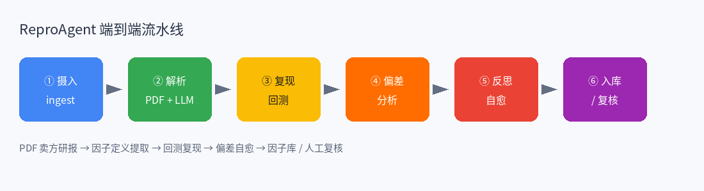


### 1.1 你能用它做什么

| 场景 | 对应能力 |
| - | - |
| 批量摄入卖方 PDF | `ingest` 校验并持久化研报 |
| 端到端因子复现 | `reproduce`：解析 + 回测 + 偏差 + 入库 |
| 浏览已复现因子 | `library` / TUI「因子库」 |
| 处理失败与人工干预 | `review` / TUI「人工复核」 |
| 交互式操作 | `tui` Textual 终端 UI |


### 1.2 架构要点

- **PDF 主后端**：内置 `finreportparser`（源自 finpdfpro），默认 `PARSER\\\_BACKEND=finpdfpro`。

- **因子提取**：LLM 结构化提取（OpenAI / Anthropic）；开发环境可无 Key 走 mock。

- **回测引擎**：默认 Polars；可选 rqalpha。

- **数据源**：`local` / `ricequant` / `qlib` / `tushare`。

- **元数据**：默认落在 `~/.reproagent/`（SQLite + 目录布局）。

## 2. 系统要求与安装

### 2.1 环境要求

- **Python**：3.12+

- **包管理**：推荐 [uv](https://github.com/astral-sh/uv)

- **操作系统**：Linux / macOS / Windows（WSL 推荐）

- **可选**：真实 LLM API Key；商业行情数据账号（米筐 / tushare 等）

### 2.2 安装步骤

```
\\\# 1. 进入项目目录    
cd /path/to/reproagent    
    
\\\# 2. 安装核心依赖（含开发工具）    
uv sync --extra dev    
    
\\\# 3. 复制环境变量模板    
cp .env.example .env
```

### 2.3 可选组件（按需安装）

| extra | 用途 |
| - | - |
| `instructor` | LLM 结构化提取（生产环境强烈建议） |
| `ricequant` | 米筐 `rqdatac` 数据 |
| `tushare` | tushare 数据 |
| `qlib` | qlib 数据（需自行安装 `pyqlib`） |
| `rqalpha` | rqalpha 评估引擎 |
| `pdf-vision` | PDF 转图（`pdf2image`） |
| `paddle` / `vlm` / `formula` | OCR / 本地 VLM / 公式识别增强 |


示例：

```
uv sync --extra dev --extra instructor --extra ricequant
```

### 2.4 验证安装

```
uv run reproagent --version    
uv run reproagent --help
```

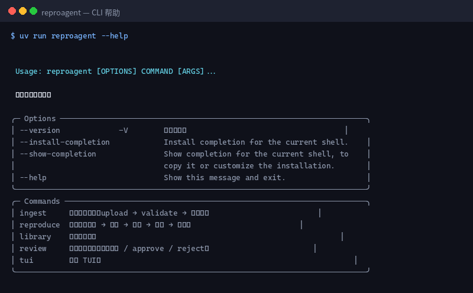

> **截图说明**：执行 `uv run reproagent --help` 后应看到五个子命令：`ingest`、`reproduce`、`library`、`review`、`tui`。若提示找不到命令，请确认已在项目根目录执行 `uv sync`，并使用 `uv run` 前缀。

## 3. 首次配置

编辑项目根目录下的 `.env`：

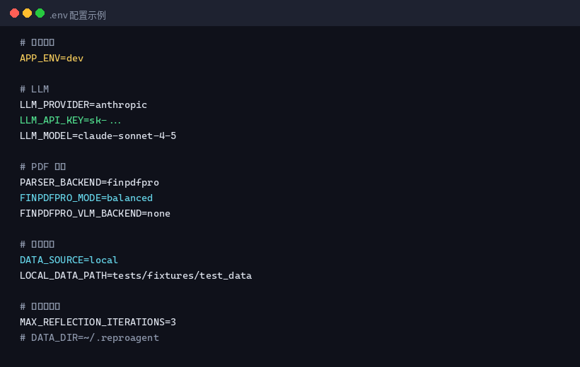

> **截图说明**：上图为典型开发配置。生产环境请将 `APP\\\_ENV=prod`，并填写真实 `LLM\\\_API\\\_KEY`；数据源按需改为 `ricequant` / `qlib` / `tushare`。

### 3.1 关键配置项

| 变量 | 说明 | 建议 |
| - | - | - |
| `APP\\\_ENV` | `dev` / `prod` | 本地试玩用 `dev`；正式跑研报用 `prod` |
| `LLM\\\_PROVIDER` | `anthropic` / `openai` | 与 Key 匹配 |
| `LLM\\\_API\\\_KEY` | API 密钥 | prod **必填**；dev 可空（mock） |
| `LLM\\\_MODEL` | 文本模型 | 如 `claude-sonnet-4-5` |
| `PARSER\\\_BACKEND` | PDF 后端 | 默认 `finpdfpro` |
| `FINPDFPRO\\\_MODE` | `fast` / `balanced` / `max-quality` | 默认 `balanced` |
| `FINPDFPRO\\\_VLM\\\_BACKEND` | VLM 增强 | 默认 `none`（不依赖 GPU） |
| `DATA\\\_SOURCE` | 行情数据源 | 离线用 `local` |
| `LOCAL\\\_DATA\\\_PATH` | 本地行情目录 | 需含 `prices.parquet` 等 |
| `MAX\\\_REFLECTION\\\_ITERATIONS` | 偏差自愈最大轮数 | 默认 `3` |
| `DATA\\\_DIR` | 数据根目录 | 默认 `~/.reproagent` |
| `TUI\\\_THEME` | TUI 主题 | 默认 `dark` |


### 3.2 运行模式对照

| `APP\\\_ENV` | 无 API Key | 公式解析失败 |
| :-: | - | - |
| `dev`（默认） | 允许确定性 **mock 因子** | 可静默降级（可关） |
| `prod` | **禁止** mock，直接报错 | 不静默退回 `close` |


显式覆盖：

```
ALLOW\\\_MOCK\\\_LLM=true          \\\# 即使 prod 也允许 mock    
ALLOW\\\_FORMULA\\\_FALLBACK=false \\\# 禁止公式降级
```

### 3.3 生产最小配置示例

```
APP\\\_ENV=prod    
LLM\\\_PROVIDER=anthropic    
LLM\\\_API\\\_KEY=sk-...    
LLM\\\_MODEL=claude-sonnet-4-5    
DATA\\\_SOURCE=ricequant    
RQ\\\_TOKEN=your\\\_token    
FINPDFPRO\\\_MODE=balanced
```

并安装：

```
uv sync --extra dev --extra instructor --extra ricequant
```

## 4. 核心概念

### 4.1 流水线阶段

1. **摄入（ingest）**：上传 PDF、哈希、页数校验，写入数据库。

2. **解析（parse）**：`finreportparser` 抽布局/文本，LLM 提取 `FactorSpec`（因子名、公式、股票池、换仓频率、研报披露指标等）。

3. **复现（reproduce）**：按规格用行情数据计算因子并回测，得到 IC、超额收益等。

4. **偏差（deviation）**：与研报披露指标对比，判断是否在容差内。

5. **反思（reflection）**：超差时 LLM 修订规格并重跑，最多 `MAX\\\_REFLECTION\\\_ITERATIONS` 次。

6. **入库 / 复核**：通过则进入因子库；失败则进入人工复核队列。

### 4.2 结果状态（reproduce 输出常见值）

| status | 含义 |
| - | - |
| `passed` | 一次回测即通过偏差阈值，已入库 |
| `converged` | 经反思循环后收敛通过，已入库 |
| `soft_passed` | 数值偏差未对齐但复现结果健康，已入库（observability.soft_pass=true；prod 模式禁用） |
| `partial` | 多因子混合结果：部分成功 / 部分 soft_passed |
| `review\\\_enqueued` | 未收敛或失败，已进人工复核队列 |
| `exhausted` | 反思循环耗尽仍未达标，未入库 |
| `error` | 该因子执行失败（详见日志） |
| `no_factors` | 未提取到任何因子 |


### 4.3 数据目录

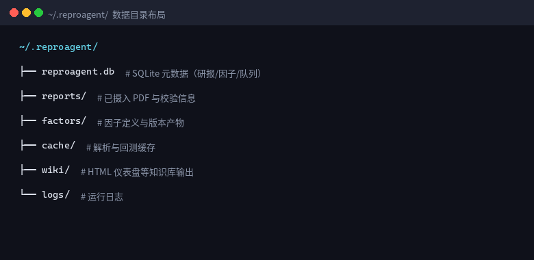

> **截图说明**：默认数据根为 `~/.reproagent/`。可通过 `DATA\\\_DIR` 改到其他路径（例如挂载盘）。删除该目录等于清空库与缓存，请先备份。

## 5. CLI 快速上手

以下示例在项目根目录执行，使用仓库自带 fixture，**无需 LLM Key 与商业数据**。

### 5.1 摄入一篇样例研报

```
uv run reproagent ingest tests/fixtures/sample\\\_reports/minimal.pdf
```

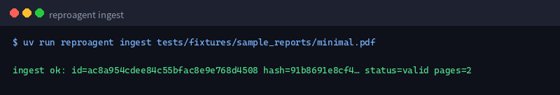

> **截图说明**：成功时打印 `ingest ok`，并给出 `id`、文件 `hash` 前缀、`status=valid` 与 `pages`。若 `status=invalid`，研报会进入复核队列且命令以非 0 退出。

### 5.2 端到端复现（离线 mock）

```
APP\\\_ENV=dev \\\\    
ALLOW\\\_MOCK\\\_LLM=true \\\\    
OPENAI\\\_API\\\_KEY= ANTHROPIC\\\_API\\\_KEY= LLM\\\_API\\\_KEY= \\\\    
DATA\\\_SOURCE=local \\\\    
LOCAL\\\_DATA\\\_PATH=tests/fixtures/test\\\_data \\\\    
uv run reproagent reproduce tests/fixtures/sample\\\_reports/minimal.pdf
```

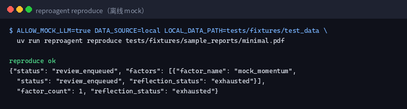

> **截图说明**：`reproduce ok` 表示流水线跑完；JSON 中的 `status` 反映业务结果。样例 fixture + mock 因子在本地行情上常出现 `review\\\_enqueued`（偏差未过阈、反思耗尽），这是预期行为，便于演示复核路径。真实研报 + 真实 LLM + 真实行情下，更可能得到 `passed` / `converged`。

### 5.3 查看因子库

```
uv run reproagent library
```

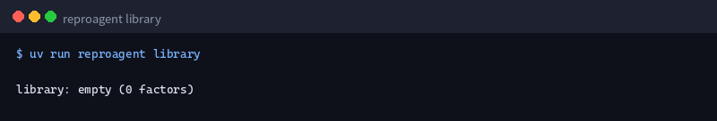

> **截图说明**：无通过偏差的因子时显示 `library: empty`。入库成功后会以表格列出 `id / name / style / status / version`。加 `--html` 可生成 HTML 仪表盘到 `~/.reproagent/wiki/dashboard.html`。

### 5.4 查看人工复核队列

```
uv run reproagent review --list
```

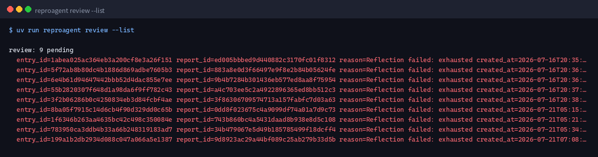

> **截图说明**：列出所有 pending 项的 `entry\\\_id`、`report\\\_id`、`reason`、时间。用 `--approve \\\<entry\\\_id\\\>` 或 `--reject \\\<entry\\\_id\\\>` 做决策；不加参数时查看队首并给出操作提示。

## 6. 命令详解

### 6.1 总览

```
reproagent \\\[OPTIONS\\\] COMMAND    
    
Commands:    
  ingest     摄入一篇研报：upload → validate → 持久化    
  reproduce  端到端：摄入 → 解析 → 复现 → 偏差 → 入库    
  library    浏览因子库    
  review     处理人工复核队列    
  tui        启动 Textual TUI
```

全局选项：`-V / --version`、`--help`、shell 补全安装选项。

### 6.2 `ingest`

```
reproagent ingest PATH/TO/report.pdf
```

| 步骤 | 行为 |
| - | - |
| upload | 复制/登记 PDF，计算文件哈希 |
| validate | 页数、可读性等基础校验 |
| persist | 写入 SQLite；失败则入复核队列 |


**适用场景**：只登记研报、稍后再批量 `reproduce`；或排查「PDF 本身是否合法」。

### 6.3 `reproduce`

```
reproagent reproduce PATH/TO/report.pdf
```

内部调用 `pipeline.reproduce\\\_report`，对一篇研报中的**多个因子**逐个处理并汇总。

**prod 注意**：`APP\\\_ENV=prod` 且未允许 mock 时，缺少 `LLM\\\_API\\\_KEY` 会直接失败并提示配置。

**依赖提示**：真实 LLM 提取需要：

```
uv sync --extra instructor
```

若未安装 instructor 且未走 mock，可能报错：`instructor is required for real LLM extraction`。

### 6.4 `library`

```
reproagent library                  \\\# 列出全部    
reproagent library --style momentum \\\# 按风格过滤    
reproagent library --html           \\\# 生成 HTML 仪表盘
```

- 文本列表：便于脚本解析与快速查看。

- `--html`：输出路径为 `\\\{DATA\\\_DIR\\\}/wiki/dashboard.html`（默认 `~/.reproagent/wiki/dashboard.html`）。

### 6.5 `review`

```
reproagent review --list    
reproagent review                       \\\# 查看队首 + 提示    
reproagent review --approve \\\<entry\\\_id\\\>    
reproagent review --reject  \\\<entry\\\_id\\\>
```

规则：

- `--approve` 与 `--reject` **不可同时使用**。

- `entry\\\_id` 来自 `--list` 输出。

- 典型入队原因：`validation\\\_failed`、`Reflection failed: exhausted` 等。

### 6.6 `tui`

```
reproagent tui    
\\\# 或    
uv run reproagent tui
```

详见下一章。

## 7. TUI 图形终端界面

启动后进入三页签应用：**复现** / **因子库** / **人工复核**。

### 7.1 全局快捷键

| 按键 | 功能 |
| - | - |
| `q` | 退出 |
| `d` | 深色 / 浅色主题切换 |
| `r` | 切到「复现」页 |
| `l` | 切到「因子库」页 |
| `v` | 切到「人工复核」页 |


页脚会显示上述绑定提示。

### 7.2 复现页

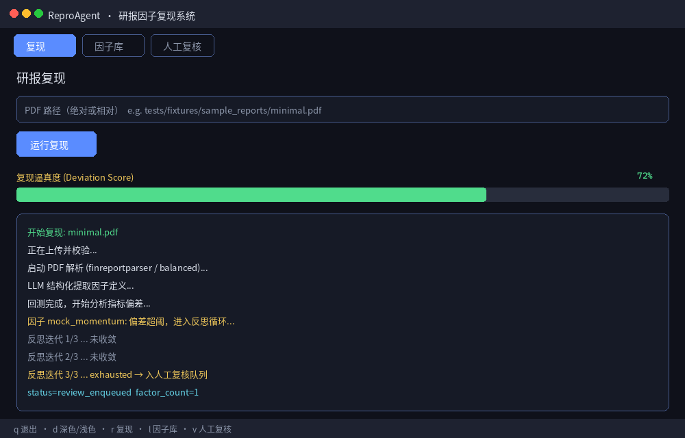

> **截图说明（示意）**：

> 1. 顶部页签「复现」高亮。

> 1. 在输入框填写 PDF **绝对路径或相对路径**。

> 1. 点击「运行复现」启动流水线。

> 1. **复现逼真度**进度条反映偏差/进度（运行中会推进；结果取决于真实 deviation score）。

> 1. 下方日志区输出上传、解析、回测、反思、最终 status。

> 操作提示：路径不存在时日志会红字报错；空路径会提示「请输入 PDF 路径」。

**推荐练习路径**（与 CLI 相同 fixture）：

```
tests/fixtures/sample\\\_reports/minimal.pdf
```

请确保 TUI 进程的工作目录为项目根，或填写绝对路径。

### 7.3 因子库页

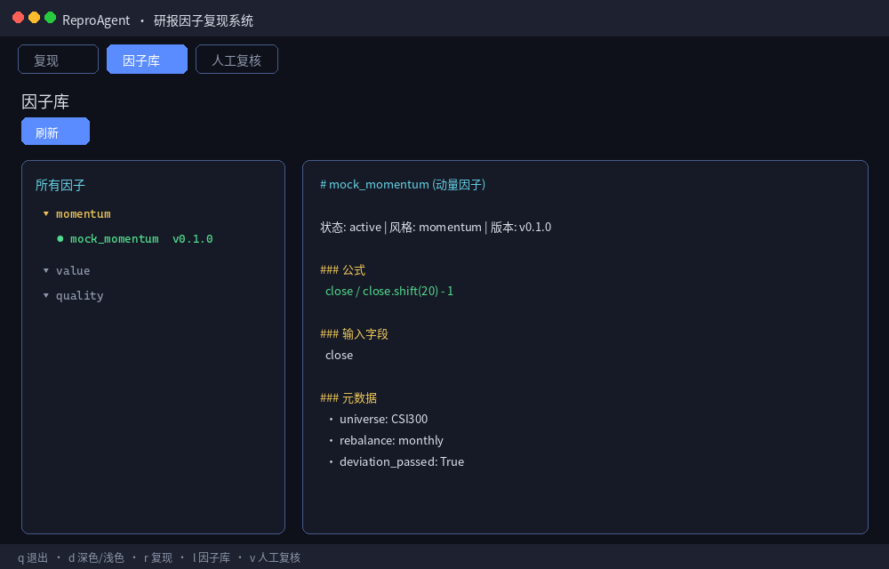

> **截图说明（示意）**：

> 1. 点击「刷新」从数据库加载最新因子。

> 1. 左侧树：按风格（如 momentum / value / quality）分组。

> 1. 选中具体因子后，右侧 Markdown 展示名称、状态、公式、输入字段、universe、换仓频率、`deviation\\\_passed` 等元数据。

> 库为空时右侧保持「请选择因子」提示；先完成一次成功入库的 `reproduce` 再刷新。

### 7.4 人工复核页

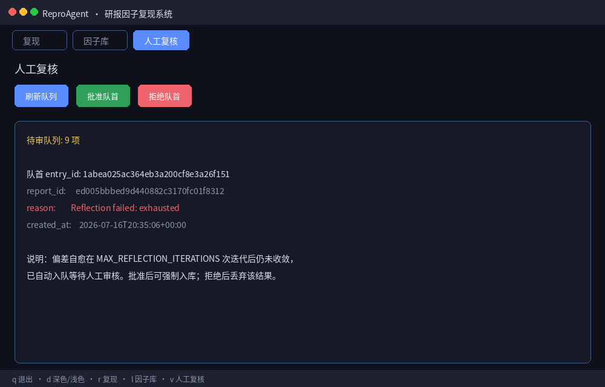

> **截图说明（示意）**：

> 1. **刷新队列**：加载当前 pending 数量与队首详情。

> 1. **批准队首**：对队首 entry 执行 approve。

> 1. **拒绝队首**：对队首 entry 执行 reject。

> 1. 状态区展示 `entry\\\_id`、`report\\\_id`、`reason`、时间戳。

> 无待审项时提示先刷新；与 CLI `review --list / --approve / --reject` 共用同一队列数据。

## 8. 数据与存储

### 8.1 目录约定

见 [4.3](#43-数据目录)。常用路径属性：

| 路径 | 内容 |
| - | - |
| `DATA\\\_DIR/reproagent.db` | 研报、因子库条目、复核队列等 |
| `DATA\\\_DIR/reports/` | 摄入的研报文件 |
| `DATA\\\_DIR/factors/` | 因子产物 |
| `DATA\\\_DIR/cache/` | 解析 / 回测缓存（加速重复运行） |
| `DATA\\\_DIR/wiki/` | HTML 仪表盘等 |
| `DATA\\\_DIR/logs/` | 日志 |


### 8.2 本地行情数据格式

`DATA\\\_SOURCE=local` 时，`LOCAL\\\_DATA\\\_PATH` 应指向包含价格等 parquet/csv 的目录。仓库自带：

```
tests/fixtures/test\\\_data/prices.parquet
```

示例：

```
export DATA\\\_SOURCE=local    
export LOCAL\\\_DATA\\\_PATH=tests/fixtures/test\\\_data
```

### 8.3 其他数据源

| `DATA\\\_SOURCE` | 依赖 | 凭证环境变量 |
| :-: | - | - |
| `local` | 无 | `LOCAL\\\_DATA\\\_PATH` |
| `ricequant` | `--extra ricequant` | `RQ\\\_TOKEN` 或 `RQ\\\_USER` + `RQ\\\_PASS` |
| `qlib` | 自行安装 pyqlib | `QLIB\\\_CN\\\_DATA\\\_PATH` |
| `tushare` | `--extra tushare` | `TUSHARE\\\_TOKEN` |


### 8.4 PDF 解析模式

| `FINPDFPRO\\\_MODE` | 特点 |
| :-: | - |
| `fast` | 速度快，复杂版式可能丢细节 |
| `balanced` | 默认均衡 |
| `max-quality` | 最高质量，更慢 |


VLM 增强（需对应 extras）：

```
FINPDFPRO\\\_VLM\\\_BACKEND=paddle\\\_vl   \\\# 或 smolvlm / llamacpp\\\_http
```

## 9. 典型工作流

### 9.1 开发自测（离线）

```
\\\# 安装    
uv sync --extra dev    
cp .env.example .env   \\\# APP\\\_ENV=dev，Key 可留空    
    
\\\# 摄入 + 复现    
ALLOW\\\_MOCK\\\_LLM=true \\\\    
DATA\\\_SOURCE=local LOCAL\\\_DATA\\\_PATH=tests/fixtures/test\\\_data \\\\    
uv run reproagent reproduce tests/fixtures/sample\\\_reports/minimal.pdf    
    
\\\# 看队列    
uv run reproagent review --list
```

### 9.2 生产：真实研报复现

```
\\\# 1. 配置    
\\\#    APP\\\_ENV=prod    
\\\#    LLM\\\_API\\\_KEY=...    
\\\#    DATA\\\_SOURCE=ricequant / qlib / ...    
uv sync --extra dev --extra instructor --extra ricequant    
    
\\\# 2. 一键复现    
uv run reproagent reproduce /data/reports/华泰\\\_估值类因子.pdf    
    
\\\# 3. 通过则浏览库；未通过则复核    
uv run reproagent library --html    
uv run reproagent review --list
```

### 9.3 只登记、稍后处理

```
for f in /data/reports/\\\*.pdf; do    
  uv run reproagent ingest "$f" || true    
done    
\\\# 再对合格 PDF 逐个 reproduce
```

### 9.4 交互式日常使用

```
uv run reproagent tui
```

在「复现」页粘贴路径运行 →「因子库」查看结果 →「人工复核」处理失败项。

## 10. 常见问题与排障

### Q1：`reproduce failed: instructor is required...`

**原因**：走了真实 LLM 路径但未装 instructor。  
**处理**：

```
uv sync --extra instructor    
\\\# 或开发环境强制 mock：    
ALLOW\\\_MOCK\\\_LLM=true LLM\\\_API\\\_KEY= uv run reproagent reproduce ...
```

### Q2：`APP\\\_ENV=prod requires LLM\\\_API\\\_KEY`

**原因**：生产模式禁止静默 mock。  
**处理**：配置真实 Key，或临时 `ALLOW\\\_MOCK\\\_LLM=true`（不推荐生产）。

### Q3：`library: empty` 但刚跑过 reproduce

**原因**：结果是 `review\\\_enqueued` / 未通过偏差，因子不会入库。  
**处理**：`review --list` 查看原因；修配置或改规格后重跑；或在复核中批准（若业务允许）。

### Q4：ingest 失败 / invalid

**原因**：PDF 损坏、加密、页数为 0、校验规则未通过。  
**处理**：用阅读器打开确认；换一份 PDF；查看是否已入复核队列。

### Q5：TUI 里路径不存在

**原因**：相对路径相对的是**启动 TUI 时的 cwd**。  
**处理**：在项目根启动 `reproagent tui`，或使用绝对路径。

### Q6：重复 reproduce 很慢 / 想清缓存

**处理**：删除 `~/.reproagent/cache/`（或你的 `DATA\\\_DIR/cache/`）。注意会丢掉解析与回测缓存。

### Q7：如何确认 PDF 后端加载正常？

```
uv run python -c "from finreportparser.config import load\\\_config; print(load\\\_config().mode)"
```

### Q8：测试套件

```
OPENAI\\\_API\\\_KEY= ANTHROPIC\\\_API\\\_KEY= uv run pytest -q    
\\\# 或    
make test
```

## 11. 附录

### 11.1 命令

| 目标 | 命令 |
| - | - |
| 帮助 | `reproagent --help` |
| 版本 | `reproagent -V` |
| 摄入 | `reproagent ingest report.pdf` |
| 全链路 | `reproagent reproduce report.pdf` |
| 因子列表 | `reproagent library` |
| HTML 看板 | `reproagent library --html` |
| 复核列表 | `reproagent review --list` |
| 批准 | `reproagent review --approve \\\<id\\\>` |
| 拒绝 | `reproagent review --reject \\\<id\\\>` |
| TUI | `reproagent tui` |


### 11.2 包结构

```
src/    
  finreportparser/   \\\# PDF 布局解析（主后端）    
  reproagent/    
    ingestion/       \\\# 摄入、校验、复核队列    
    parser/          \\\# 布局 + LLM 提取 + schema    
    reproducer/      \\\# 因子计算与回测    
    deviation/       \\\# 偏差与反思    
    library/         \\\# 因子库与仪表盘    
    persistence/     \\\# DB 与路径    
    tui/             \\\# Textual 前端    
    pipeline.py      \\\# 端到端编排    
    cli.py           \\\# Typer CLI    
configs/             \\\# finreportparser YAML    
tests/fixtures/      \\\# 样例 PDF 与本地行情
```

### 11.3 截图清单

| 文件 | 内容 |
| - | - |
| `images/00-pipeline-flow.png` | 端到端流水线示意 |
| `images/01-cli-help.png` | CLI 帮助（真实输出） |
| `images/02-cli-ingest.png` | ingest 成功（真实输出） |
| `images/03-cli-reproduce.png` | reproduce mock 结果（真实输出整理） |
| `images/04-cli-library.png` | library 列表（真实输出） |
| `images/05-cli-review.png` | review 队列（真实输出） |
| `images/06-tui-reproduce.png` | TUI 复现页（界面示意） |
| `images/07-tui-library.png` | TUI 因子库（界面示意） |
| `images/08-tui-review.png` | TUI 人工复核（界面示意） |
| `images/09-data-dir.png` | 数据目录布局 |
| `images/10-env-config.png` | `.env` 配置示例 |


